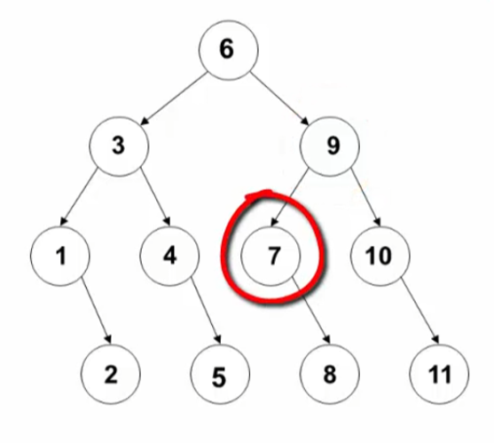
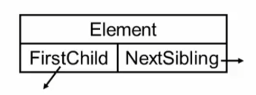
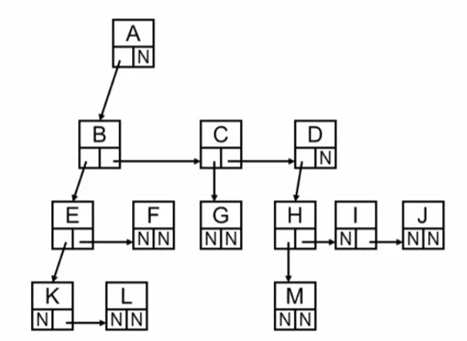

## 3.1.1引子（顺序查找）
什么是树
客观世界中许多事物存在层次关系
1. 人类社会家谱
2. 社会组织结构
3. 图书信息管理

**分层次组织在管理上有更高的效率**

数据管理的基本操作之一：查找

**如何实现有效率的查找？**

**查找**：根据某个给定的**关键字**`K`，从集合`R`中找出与`K`相同的记录

**静态查找**：集合中**记录是固定**的
>没有插入和删除操作，只有查找

**动态查找**：集合中的**记录是动态变化**的
>除查找外，还有可能发生插入和删除

#### 静态查找
##### 方法1：顺序查找
```C
/* 方法1：顺序查找 */
#define MAXSIZE 1000
typedef int ElementType;
typedef struct LNode *List;
struct LNode
[
    ElementType Element[MAXSIZE];
    int Length;
]

int SequentialSearch(List Tbl,ElementType K)
{/* 在Element[1]~Element[n]中查找关键字为K的数据元素 */
    int i;
    Tbl->Element[0]=K;      /* 建立哨兵 */
    for (i=Tbl->Length;Tbl->Element[i]!=K;i--)
    return i;               /* 查找成功则返回所在单元下标，否则返回0 */
}

/* 无哨兵时的实现 */
int SequentialSearch(List Tbl,ElementType K)
{/* 在Element[1]~Element[n]中查找关键字为K的数据元素 */
    int i;
    for (i=Tbl->Length;i>0&&Tbl->Element[i]!=K;i--)
    return i;               /* 查找成功则返回所在单元下标，否则返回0 */
}
/* 时间复杂度为O（n） */
```

## 3.1.2引子（二分查找）
假设n个数据元素的关键字满足**有序**

$k_1<k_2<\cdots<k_n$

并且是连续存放（**数组**），那么可以进行二分查找
## 3.1.3引子（二分查找实现）
#### 二分查找算法
```C
/* 方法2：二分查找（Binary Search） */
#define MAXSIZE 1000
typedef int ElementType;
typedef struct LNode *List;
struct LNode
{
    ElementType Element[MAXSIZE];
    int Length;
}

int BinarySearch(List Tbl,ElementType K)
{/* 在表Tbl中查找关键字为K的数据元素 */
    int left,right,mid,NotFound--1;

    left=1;                 /* 初始化左边界 */
    right=Tbl->Length;      /* 初始化右边界 */
    while(left<=right)
    {
        mid=(left+right)/2; /* 计算中间元素坐标 */
        if(K<Tbl->Element[mid])
        {
            right=mid-1;    /* 调整右边界 */
        }
        else if(K>Tbl->Element[mid])
        {
            left=mid+1;     /* 调整左边界 */
        }
        else
        {
            return mid;     /* 查找成功，返回数据元素的下标 */
        }
    }
    return NotFound;        /* 查找失败，返回-1 */
```
时间复杂度为： $O(logN)$

11个元素的二分查找判定树

* 判定树上每个结点需要的查找次数刚好为该结点所在的层数
* 查找成功时查找次数不会超过判定树的深度
* **n个结点的判定树的深度为 $[log_2n]+1$**，就是取对数后向上取整
* 平均成功查找次数 $ASL=(4\*4+4\*3+2\*2+1)/11$
## 3.1.4树的定义和术语
树（`Tree`）： $n$个结点构成的有限集合

当 $n=0$时，称为空树

对于任一颗非空树，它具备以下性质
1. 树中有一个称为根（`Root`）的特殊结点，用r表示
2. 其余结点可分为m个互不相交的有限集 $T_1,T_2,\cdots,T_m$，其中每个集合本身又是一棵树，称为原来树的子树（`SubTree`）

**树与非树？**
1. 子树是不相交的
2. 除了根结点外，每个结点有且仅有一个父结点
3. 一颗 $N$结点的树有 $N-1$条边

树是保证结点连通的最小连接方式
>问： $m$棵树的集合，有 $k$条边，一共几个结点？

>答： $m+k$个结点，一条边对应一个结点，根结点没有边对应， $m$棵树就有 $m$个根结点，故一共 $m+k$个结点。

**树的一些基本术语**
1. **结点的度**（`Degree`）：结点的**子树个数**
2. **树的度**：树的所有结点中最大的度数
3. **叶结点**（`Leaf`）：**度为0**的结点
4. **父结点**（`Parent`）：有子树的结点是其子树的根结点的父结点
5. **子结点**（`Child`）：若A结点是B结点的父结点，则称B结点是A结点的子结点；子结点也称孩子结点
6. **兄弟结点**（`Sibling`）：具有同一父结点的各结点彼此是兄弟结点
7. **路径和路径长度**：从结点 $n_1$到 $n_k$的**路径**为一个结点序列 $n_1,n_2,\cdots,n_k$， $n_i$是 $n_{i+1}$的父结点，路径所包含的边的个数为**路径的长度**
8. **祖先结点**（`Ancestor`）：沿**树根到某一结点路径**上的所有结点都是这个结点的祖先结点
9. **子孙结点**（`Descendant`）：某一结点的**子树中的所有结点**是这个结点的子孙
10. **结点的层次**（`Level`）：规定**根结点在1层**，其他任以结点的层数是其父结点的层数+1
11. **树的深度**（`Depth`）：树中所有结点中的**最大层次**是这棵树的深度

高度从0开始，层数从1开始
## 3.1.5树与树的表示
**树的表示**
儿子兄弟表示法


>在用“儿子-兄弟”法表示的树中，如果从根结点开始访问其“次子”的“次子”，所经过的结点数与下面哪种情况一样？(注意:比较的是结点数,而不是路径)

>访问到次子：两个结点，再到次子的次子，又是两个结点。共4个结点

>从根结点开始访问其“长子”的“长子”的“长子”的“长子”

#### 二叉树的链表结构
```C
typedef struct TNode *Position
typedef Position BinTree /*二叉树类型*/
struct TNode  /*树结点定义*/
{
	ElementType Data;  /*结点数据*/
	BinTree Left;  /**/
	BinTree Right;
}
```
