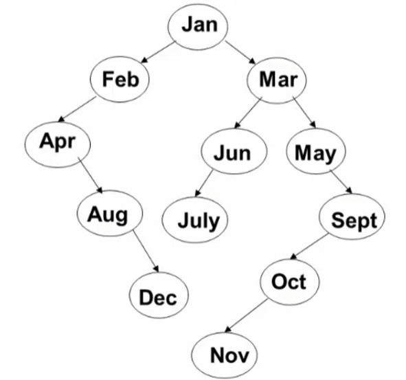
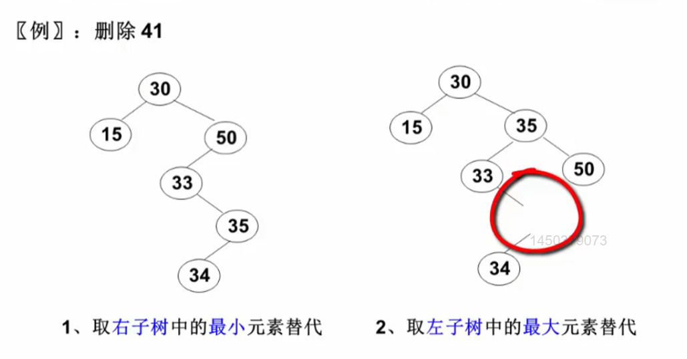

## 4.1.1二叉搜索树及查找
查找问题
1. 静态查找与动态查找（二分查找，事先组织，有序化）
2. 针对动态查找，数据如何组织？

#### 什么是二叉搜索树
**二叉搜索树（BST,Binary Search Tree）**，也称**二叉排序树或二叉查找树**

二叉搜索树：一颗二叉树，可以为空；如果不为空，满足以下性质：
1. 非空左子树的所有键值小于其根结点的键值
2. 非空右子树的所有键值大于其根结点的键值
3. 左右子树都是二叉搜索树

#### 二叉搜索树操作的特别函数
1. `Position Find(ElementType X,BinTree BST`：从二叉搜索树BST中查找元素X，返回其所在结点的地址
2. `Position FindMin(BinTree BST)`：从二叉搜索树BST中查找并返回最小元素所在结点的地址
3. `Position FindMax(BinTree BST)`：从二叉搜索树BST中查找并返回最大元素所在结点的地址
4. `BinTree Insert(ElementType X,BinTree BST)`
5. `BinTree Delete(ElementType X,BinTree BST)`

#### 二叉搜索树的查找操作：Find
* 查找从根结点开始，如果树为空，返回`NULL`
* 若搜索树非空，则根结点关键字和`X`进行比较，并进行不同处理
	* 若`X`小于根结点键值，只需在左子树中继续搜索
	* 若`X`大于根结点键值，只需在右子树中继续搜索
	* 若两者比较结果是相等，搜索完成，返回指向此结点的指针

```C
Position Find(ElementType X,BinTree BST)
{
    if(!BST)
    {
        return NULL;  /* 查找失败 */
    }
    if(X>BST->Data)
    {
        return FInd(X,BST->Right);  /* 在右子树中继续查找 */
    }
    else if(X<BST->Data)
    {
        return Find(X,BST->Left);  /* 在左子树中继续查找 */
    }
    else  /* X==BST->Data */
    {
        return BST;  /* 查找成功，返回节点的找到结点的地址 */
    }
}
```
由于非递归函数的执行效率高，可将尾递归函数改为迭代函数
```C
Position IterFind(ElementType X,BinTree BST)
{
    while(BST)
    {
        if(X>BST->Data)
        {
            BST=BST->Right;  /* 向右子树中移动，继续查找 */
        }
        else if (X<BST->Data)
        {
            BST=BST->Left;  /* 向左子树中移动，继续查找 */
        }
        else  /* X==BST->Data */
        {
            return BST;  /* 查找成功，返回结点的已找到结点的地址 */
        }
    }
    return NULL;  /* 查找失败 */
}
```
**查找的效率决定于树的高度**

平衡二叉树
#### 查找最大和最小元素
* 最大元素一定是在树的最右分支的端结点上
* 最小元素一定是在树的最左分支的端结点上

```C
Position FindMin(BinTree BST)
{
    if(!BST)
    {
        return NULL;  /* 空的二叉搜索树，返回NULL */
    }
    else if(!BST->Left)
    {
        return BST;  /* 找到最左叶结点并返回 */
    }
    else
    {
        return FindMin(BST->Left);  /* 沿左分支继续查找 */
    }
}
```
查找最小元素的递归函数
```C
Position FindMax(BinTree BST)
{
    if(BST)
    {
        while(BST->Right)
        {
            BST=BST->Right;  /* 沿右分支继续查找，直到最右结点 */
        }
    }
    return BST;
}
```
查找最大元素的迭代函数
## 4.1.2二叉搜索树的插入
分析：关键是要找到元素应该插入的位置，可以采用与`Find`类似的方法
```C
BinTree Insert(ElementType X,BinTree BST)
{
    if(!BST)
    {  /* 若原树为空，生成并返回一个结点的二叉搜索树 */
        BST=malloc(sizeof(struct TreeNode));
        BST->Data=X;
        BST->Left=BST->Righ=NULL
    }  /* 开始找要插入元素的位置 */
    if(X<BST->Data)
        BST->Left=Insert(X,BST->Left);  /* 递归进入左子树 */
    else if(X>BST->Data)
        BST->Right=Insert(X,BST->Right);  /* 递归进入右子树 */
    /* else X已经存在，什么都不做 */
    return BST;
}
```
例：以一年十二个月的英文缩写作为键值，按从一月到十二月顺序输入

## 4.1.3二叉搜索树的删除
考虑三种情况
1. 要删除的是叶结点：直接删除，并再修改其父结点指针--置为`NULL`
2. 要删除的结点只有一个孩子结点：
	1. 将其父结点的指针指向要删除结点的孩子结点
3. 要删除的结点有左右两颗子树：
	1. 用另一结点代替被删除的结点：右子树的最小元素或者左子树的最大元素

```C
BinTree Delete(ElementType X,BinTree BST)
{
    Position Tmp;
    if(!BST)
        printf("要删除的元素未找到");
    else if(X<BST->Data)
        BST->Left=Delete(X,BST->Left);  /* 左子树递归删除 */
    else if(X>BST->Data)
        BST->Right=Delete(X,BST->Right);  /* 右子树递归删除 */
    else  /* 找到要删除的结点 */
    {
        if(BST->Left&&BST->Right)  /* 被删除的结点有左右两个子结点 */
        {
            Tmp=FindMin(BST->Right);  /* 在右子树中找最小的元素填充删除节点 */
            BST->Data=Tmp->Data;
            BST->Right=Delete(BST->Data,BST->Right);
            /* 在删除节点的右子树中删除最小元素 */
        }
        else  /* 被删除结点有一个或无子结点 */
        {
            Tmp=BST;
            if(!BST->Left)  /* 有右孩子，或者无子结点 */
                BST=BST->Right;
            else if(!BST->Right)  /* 有左孩子或者无子结点 */
                BST=BST->Left;
            free(Tmp);
        }
    }
    return BST;
}
```