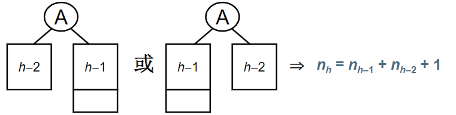

## 4.2.1什么是平衡二叉树
例：搜索树结点不同插入次序，将导致不同的**深度**和平均查找长度**ASL**

1. $ASL(a)=3.5$
2. $ASL(a)=3.0$
3. $ASL(a)=6.5$

**平衡因子**（ $Balance Factor$，简称 $BF$）： $BF(T)=h_L-h_R$，其中 $h_L$和 $h_R$分别为 $T$的左右子树高度

**平衡二叉树**（Balance Binary Tree）(AVL树)
1. 空树
2. 任一结点左右子树高度差的绝对值不超过1，即 $|BF(T)\leq1|$

#### 平衡二叉树的高度能达到 $log_2n$吗？
设 $n_h$是高度为 $h$的平衡二叉树的最少结点数，结点最少时：
$$n_h=n_{h-1}+n_{h-2}+1$$

$$n_h=F_{h+2}-1$$
$$\Rightarrow F_i=\frac{1}{\sqrt5}(\frac{1+\sqrt5}{2})^i$$
$$\Rightarrow n_h=\frac{1}{\sqrt5}(\frac{1+\sqrt5}{2})^{h+2}-1$$
$$\Rightarrow h=O(log_2n)$$
给定结点数为 $n$的AVL树，最大高度为  $O(log_2n)$
## 平衡二叉树的调整

