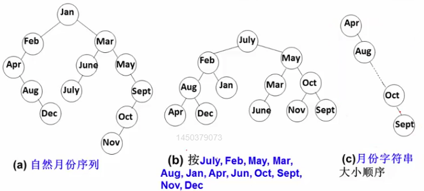
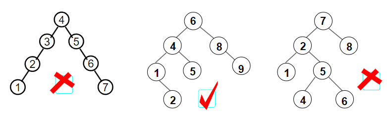

## 4.2.1什么是平衡二叉树
例：搜索树结点不同插入次序，将导致不同的**深度**和平均查找长度**ASL**

1. $ASL(a)=3.5$
2. $ASL(a)=3.0$
3. $ASL(a)=6.5$

**平衡因子**（Balance Factor，简称BF）： $BF(T)=h_L-h_R$，其中 $h_L$和 $h_R$分别为 $T$的左右子树高度

**平衡二叉树**（Balance Binary Tree）(AVL树)
1. 空树
2. 任一结点左右子树高度差的绝对值不超过1，即 $|BF(T)\leq1|$

#### 平衡二叉树的高度能达到 $log_2n$吗？
