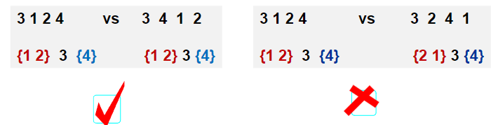

## 1.题意理解及搜索树表示
>给定一个插入序列就可以唯一确定一颗二叉搜索树，然而，一颗给定的二叉搜索树却可以由多种不同的插入序列得到
* 例如，按照 $\{2,1,3\}$和 $\{2,3,1\}$插入初始为空的二叉搜索树，都得到一样的结果

>问题：对于输入的各种插入序列，你需要判断它们是否能生成一样的二叉搜索树

#### 求解思路
两个序列是否对应相同搜索树的判别
1. 分别建两颗搜索树的判别方法
	1. 根据两个序列分别建树，再判别树是否一样
2. 不建树的判别方法
3. 建一棵树，再判别其他序列是否与该树一致

1. 搜索树表示
2. 建搜索树 $T$
3. 判别一序列是否与搜索树 $T$一致
```C
typedef struct TreeNode *Tree;
struct TreeNode
{
    int v;
    Tree Left,Right;
    int flag;
};
```
## 2.程序框架及建树
需要设计的主要函数：
1. 读数据建搜索树 $T$
2. 判别一序列是否与 $T$构成一样的搜索树
wwww

## 3.搜索树是否一样的判别